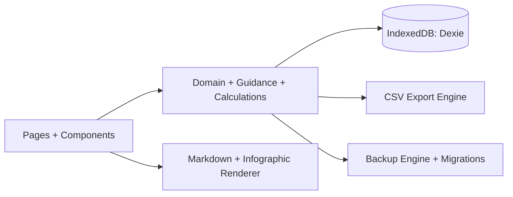
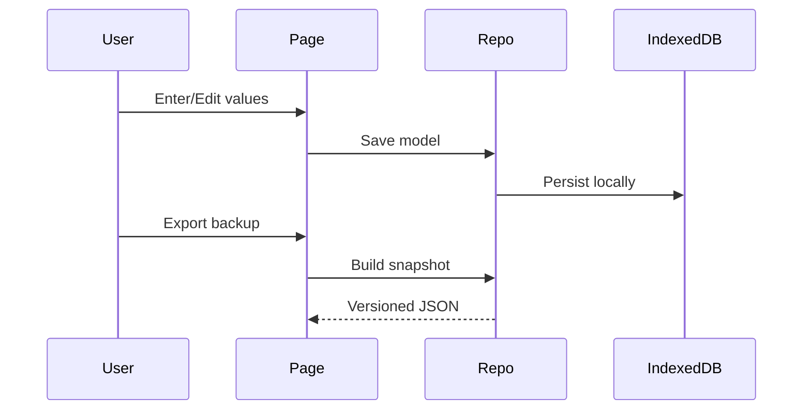

# Katalis Construye - Web Application

<p align="center">
  
</p>

Production-grade Next.js application for the public, free Katalis Construye web-book.

---

## What This App Delivers

- Structured financial learning experience (chapters + guided path)
- Interactive financial tooling (18 tools total)
- Local-first persistence with backup/import support
- PWA installability and offline fallbacks
- Spanish-first UX with finance-specific guidance

## Runtime Scheme



## Key Application Areas

### App Routes

- `app/page.tsx` - Landing and product entry
- `app/learn/page.tsx` - Guided learning route
- `app/library/page.tsx` - Chapter library
- `app/chapter/[slug]/page.tsx` - Chapter reader
- `app/tools/page.tsx` - Tool catalog
- `app/tools/*/page.tsx` - Tool detail pages
- `app/onboarding/page.tsx` - Initial configuration
- `app/settings/page.tsx` - User settings, backups, resets
- `app/offline/page.tsx` - Offline fallback
- `app/not-found.tsx` - 404 page
- `app/aviso-de-privacidad/page.tsx` - Privacy page
- `app/terminos-y-condiciones/page.tsx` - Terms page
- `app/politica-de-cookies/page.tsx` - Cookies policy page
- `app/api/leads/route.ts` - Lead capture endpoint

### UI Components

- Navigation and shell: `components/app-nav.tsx`, `components/footer.tsx`
- Branding: `components/brand-logo.tsx`
- Learning: `components/interactive-index.tsx`, `components/progress-controls.tsx`
- Content rendering: `components/markdown-content.tsx`, `components/chapter-infographic.tsx`
- Guidance system:
  - `components/stage-guidance-card.tsx`
  - `components/tool-purpose-card.tsx`
  - `components/tool-stepper.tsx`
  - `components/field-guide-hint.tsx`
  - `components/result-interpretation-card.tsx`
  - `components/microtips-panel.tsx`
- Shared tool shell: `components/advanced-tool-page.tsx`

### Domain and Logic Modules

- Domain contracts: `lib/domain.ts`
- Persistence/repository: `lib/db.ts`, `lib/repo.ts`
- Validation and migrations: `lib/schemas.ts`, `lib/backup.ts`, `lib/schema-version.ts`
- Learning model: `lib/learn.ts`
- Guidance rules: `lib/guidance/*`
- Financial calculations:
  - Core: `lib/calculations/{cashflow,budget,breakeven,kpi}.ts`
  - Advanced: `lib/calculations/advanced/*`
- Formula traceability: `lib/formulas/registry.ts`, `lib/formulas/vba-critical.ts`
- CSV engine: `lib/csv/{types,core,builders}.ts`

## Tool Portfolio

### Core Tools

- Cash Flow
- Costs vs Expenses
- Annual Budget
- Break-even Calculator
- KPI Dashboard

### Advanced Tools

- Unit Economics
- Financing Options
- Debt Manager
- Profitability Analyzer
- Financial Strategy Planner
- Contingency Planner
- Financial Education Kit
- Investment Evaluator
- Business Model Analyzer
- International Finance Manager
- Fintech Evaluator
- Valuation Calculator
- Resilience Evaluator

## Data and Persistence



- Main storage: IndexedDB (Dexie)
- Currency display mode: base or USD
- Sample-data lifecycle per tool (`sample`, `user`, dismissed/consumed states)
- Versioned backup/import with migration support (`CURRENT_SCHEMA_VERSION = 4`)

## PWA and Assets

- Manifest: `app/manifest.ts`
- Brand icons: `public/brand/katalis-logo-*.png`
- Offline route: `app/offline/page.tsx`
- Local font: `app/fonts/lufga/*`

## Development

```bash
npm install
npm run dev
```

Open `http://localhost:3000`.

## Verification

```bash
npm test
npm run lint
npm run build
```

## Notes

- The product is public and free.
- The app is local-first by design; financial data does not require cloud sync.
